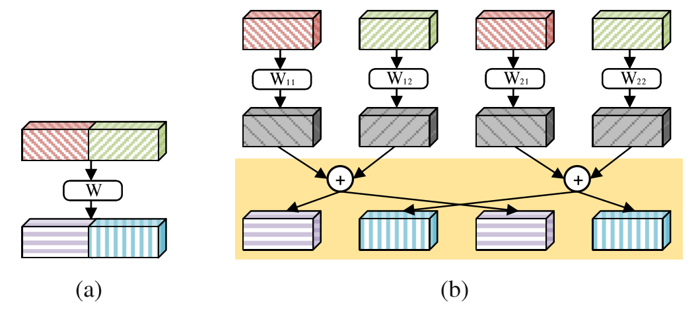
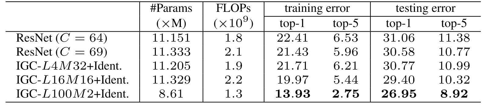

# Interleaved Group Convolutions

This project contains the code implementation used for the experiments in the paper:

>  Interleaved Group Convolutions. Ting Zhang, Guo-Jun Qi, Bin Xiao, and Jingdong Wang. In International Conference on Computer Vision (ICCV), 2017.
arXiv preprint [arXIV:1707.02725](https://arxiv.org/pdf/1707.02725.pdf) (2017)


## Introduction
In this work, we present a simple and modularized neural network architecture, named interleaved group convolutional neural networks (IGCNets). The main point lies in a novel building block, a pair of two successive interleaved group convolutions: primary group convolution and secondary group convolution. The two group convolutions are complementary.


>  Illustrating the interleaved group convolution, with L = 2 primary partitions and M = 3 secondary partitions. The convolution for each primary partition in primary group convolution is spatial. The convolution for each secondary partition in secondary group convolution is point-wise (1 × 1).

Our motivation comes from the four branch presentation of regular convolution illustrated in the following picture.


> (a) Regular convolution. (b) Four-branch representation of the regular convolution. The shaded part in (b), we call crosssummation, is equivalent to a three-step transformation: permutation, secondary group convolution, and permutation back.

## Results


>  Imagenet classification results of a ResNet of depth 18 and our approach. Both ResNets and our networks contain four stages, and when down-sampling is performed, the channel number is doubled. For ResNets, C is the channel number at the first stage. For our networks except IGC-L100M2+Ident., we double the channel number by doubling M and keeping L unchanged. For IGCL100M2+Ident., we double the channel number by doubling L and keeping M unchanged. 

More results can be found in the paper.

## Requirements
- Install [MXNet](https://github.com/apache/incubator-mxnet) on a machine (Windows, Linux, and Mac OS) with CUDA GPU and optional [cuDNN](https://developer.nvidia.com/cudnn).

- Add the code in `src/` to MXNet `src/operator/`

- Build [MXNet](http://mxnet.io/how_to/index.html)

- If you fail to apply the above steps, you can simply use [my MXNet repository](https://github.com/hellozting/mxnet)

## How to Train
Current code supports training IGCNets on Cifar-10, Cifar-100 and SVHN, such as `plain`, `resnet`, `plain_igc`,`resnet_igc`. All the networks are contained in the `network` folder.

For example, running the following command can train the `plain_igc` network on Cifar-10.

```shell
python train_model.py --network=plain_igc --depth=38 --gpus=0,1 --primary-partition=24 --secondary-partition=2 --batch-size=64 --data-dir=<dataset location> --dataset=cifar10
```

For example, running the following command can train the `resnet_igc_imgnet_d18` network on ImageNet.

```shell
python train_imagenet.py --network=resnet_igc_imgnet_d18 --depth=18 --gpus=0,1,2,3,4,5,6,7 --primary-partition=100 --batch-size=256 --data-dir=<dataset location>
```

## Citation

Please cite our papers on deep fusion in your publications if it helps your research:

```
@article{WangWZZ16,
  author    = {Jingdong Wang and
               Zhen Wei and
               Ting Zhang and
               Wenjun Zeng},
  title     = {Deeply-Fused Nets},
  journal   = {CoRR},
  volume    = {abs/1605.07716},
  year      = {2016},
  url       = {http://arxiv.org/abs/1605.07716}
}
```

```
@article{ZhaoWLTZ16,
  author    = {Liming Zhao and
               Jingdong Wang and
               Xi Li and
               Zhuowen Tu and
               Wenjun Zeng},
  title     = {On the Connection of Deep Fusion to Ensembling},
  journal   = {CoRR},
  volume    = {abs/1611.07718},
  year      = {2016},
  url       = {http://arxiv.org/abs/1611.07718}
}
```

```
@article{DBLP:journals/corr/ZhangQ0W17,
  author    = {Ting Zhang and
               Guo{-}Jun Qi and
               Bin Xiao and
               Jingdong Wang},
  title     = {Interleaved Group Convolutions for Deep Neural Networks},
  journal   = {CoRR},
  volume    = {abs/1707.02725},
  year      = {2017},
  url       = {http://arxiv.org/abs/1707.02725}
}
```